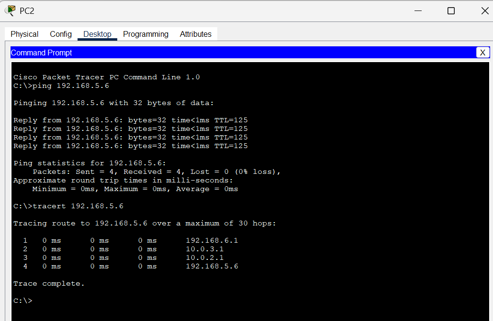

# Tracert Testing in Cisco Packet Tracer

Detects The Hops Traveled by The Data Packet

## Objective

Practice configuring static routing between routers, practice configuring ip dhcp for pc, learn how traceroute works, understand the path (hop) traveled by data packets from one device to another in the network using the tracert command in Cisco Packet Tracer.

## Skills Learned

- Configuring static routing between routers
- Configuring ip dhcp for pc
- Learn how traceroute works
- Understand the path (hops) traveled by data packets from one device to another in the network using the tracert command in Cisco Packet Tracer

## Tools Used

- Cisco Packet Tracer
- Router, Switch, and PC as network devices
- Network connections between devices
- Command Prompt

## Steps

<b> 1. Preparing the Network </b>
- Creating a simple network topology  
    
  PC1 – SWITCH1 – R1 – R2 – R3 – SWITCH2 – PC2
  - PC1 connects to Router1 via Switch1
  - Router1 and Router3 connect to Router2
  - PC2 connects to Router3 via Switch2
  - R1 ↔ R2: 10.0.2.1/24
  - R2 ↔ R3: 10.0.3.1./24
  - R1 ↔ PC1: 192.168.5.0/24
  - R3 ↔ PC2: 192.168.6.0/24
- Assign an IP Address to each PC, Router, and Switch  
  >> Configure Router1 IP Address and DHCP IP for PCs  
    
  
  >> Configure Router2 IP Address  
    
  
  >> Configure Router3 IP Address and DHCP IP for PCs  
    

<b> 2. Configuring Routing </b>
- Configure static routing between routers to ensure devices can communicate with each other.  
  >> Configure static routing on Router1  
    
  
  >> Configure static routing on Router2  
    
  
  >> Configure static routing on Router3  
    

<b> 3. Performing Traceroute Testing </b>
- Open Command Prompt on PC1 and PC2
- Type the ping [IP address PC1/PC2] command to ensure that PC1 and PC2 can communicate with each other.
- Type the tracert [IP address PC1/PC2] command to find out the path taken by the packet.  

<i>This can be seen in the Results and Analysis section below.</i>

### Results and Analysis
- Tracert results to PC2 that appear on PC1:  
    
  Analysis:
  - The ping from PC1 to PC2 was successful, meaning they could communicate with each other.
  - Tracert to PC2 from PC1 cmd shows that to get to PC2, PC1 must pass through the hops/paths of the IP address:
    1.	Router1: 192.168.5.1 (g0/0)
    2.	Router2: 10.0.2.2 (g0/0)
    3.	Router3: 10.0.3.2 (g0/0)
    4.	PC2: 192.168.6.6 (Finish)
  - The travel time (latency) of this trace shows 0ms which means it is very close and the packet reaches the destination as expected.

- Tracert results to PC1 that appear on PC2:  
    
  Analysis:
  - The ping from PC2 to PC1 was successful, meaning they can communicate with each other.
  - Tracert to PC1 from PC2 cmd shows that to get to PC1, PC2 must pass through the hops/paths of the IP address:
    1.	Router3: 192.168.6.1 (g0/1)
    2.	Router2: 10.0.3.1 (g0/1)
    3.	Router1: 10.0.2.1 (g0/1)
    4.	PC1: 192.168.5.6 (Finish)
  - The travel time (latency) of this trace shows 0ms which means it is very close and the packet reaches the destination as expected.

### Advice
- Ensure that all devices are properly connected and IP configured accordingly.
- Use tracert/traceroute to analyze the communication path and fix any problems that may occur in the network.

## Conclusion

The trace results show the path taken by data packets from PC1 to PC2 and vice versa. And there are also no problems with network configuration and PCs between Routers can communicate with each other. Traceroute / tracert can provide information on the hops / paths taken to arrive at the destination and help in troubleshooting network problems by knowing the problem points on the communication path.
